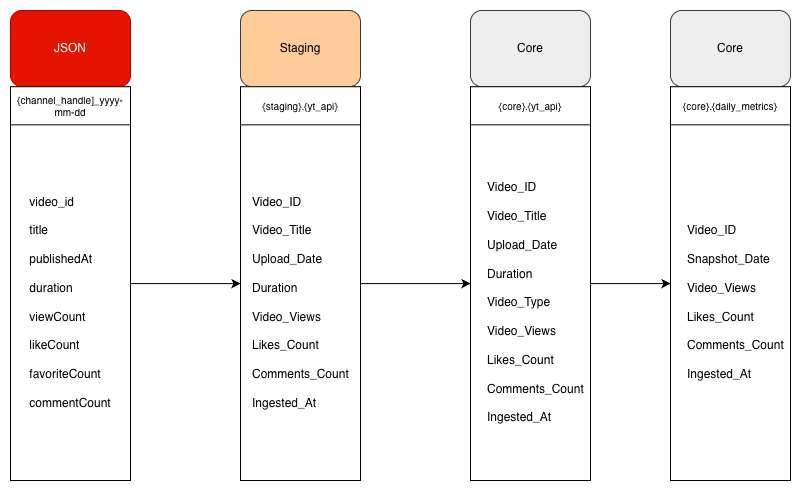

# Column-Level Lineage Documentation  
YouTube ELT Pipeline

## High-Level Lineage Flow

| Layer | Object | Purpose |
|------|-------|---------|
| Raw | JSON files | Immutable API snapshots |
| Staging | staging.yt_api | Raw-but-typed landing table |
| Core | core.yt_api | Canonical current-state table |
| Metrics | core.yt_api_metrics_daily | Historical daily snapshots |

## Raw JSON → staging.yt_api

| Staging Column | Source JSON Field | Transformation | Notes |
|---------------|------------------|----------------|------|
| Video_ID | video_id | Direct | Primary identifier |
| Video_Title | title | Direct | |
| Upload_Date | publishedAt | Cast to TIMESTAMP | |
| Duration | duration | Direct (ISO 8601) | Parsed later |
| Video_Views | viewCount | BIGINT | Nullable |
| Likes_Count | likeCount | BIGINT | Nullable |
| Comments_Count | commentCount | BIGINT | Nullable |
| Ingested_At | System time | now() | Ingestion timestamp |

## staging.yt_api → core.yt_api

| Core Column | Source Column | Transformation | Notes |
|------------|--------------|----------------|------|
| Video_ID | Video_ID | Direct | PK |
| Video_Title | Video_Title | Direct | |
| Upload_Date | Upload_Date | Direct | |
| Duration | Duration | ISO → INTERVAL | |
| Video_Type | Derived | Business rule | |
| Video_Views | Video_Views | Direct | |
| Likes_Count | Likes_Count | Direct | |
| Comments_Count | Comments_Count | Direct | |
| Ingested_At | System time | now() | Latest refresh |

## core.yt_api → core.yt_api_metrics_daily

| Metrics Column | Source Column | Transformation | Notes |
|---------------|--------------|----------------|------|
| Video_ID | Video_ID | Direct | FK |
| Snapshot_Date | Airflow logical_date | date() | Deterministic |
| Video_Views | Video_Views | Direct | Snapshot |
| Likes_Count | Likes_Count | Direct | Snapshot |
| Comments_Count | Comments_Count | Direct | Snapshot |
| Ingested_At | System time | now() | Insert time |
